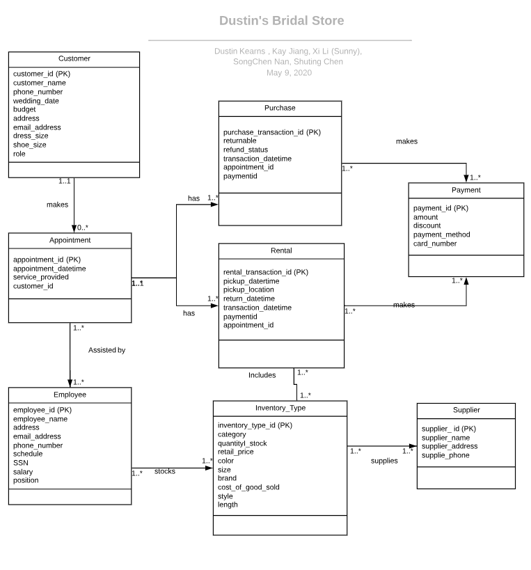

# Dustin-s-Bridal-Shop-2019

## Context

Every woman dreams of her wedding day, walking down the aisle with all of her loved ones looking on as she professes her love for the person of her dreams. 
Dustin’s Bridal Shop is here to help make that dream come true. We provide an endless array of elegant gowns, 
veils and accessories that will make you and your bridesmaids look unforgettable. With our full set of products and services we will not only make your wedding planning easy, 
we will make your wedding day one to cherish for a lifetime.

This project builds a database management system for our business, in order to create efficiency for our business processes. 
This tool is expected to assist in navigating information of our customers, employees, inventories, suppliers, appointments, and sales transactions. 
This project presents the development of our database management system, including system analysis, logical and physical modeling, database implementation and application implementation. 

## Entities:
-	Appointment
-	Customer
-	Employee
-	Inventory
-	Supplier
-	Purchase 
-	Rental 
-	Payment 

## Entity Relationship Diagram (E-R Diagram) using UML notation

## Logical and Physical Modeling --> project_SQL_script.txt

Application Implementation --> .accdb

1.	Managers’ need to view employees by schedule, position, and salary
2.	Customers’ need to view products by style/color and their rental schedule
3.	Inventory Clerks’ need to view low-in-stock products, and the highest purchases or rentals

## Summary
This project has been a meaningful and entertaining experience for me. It was our first time building a database management system from scratch. I was excited to put techniques learned in class into practice, which helped us to transform concepts learned on paper into knowledge known by heart. 

The easiest part for me was the first step - system analysis, where I brainstormed entities required and collected information needs. I also found the data creation and input process to be very easy, albeit tedious.

However, logical and physical modeling was the biggest challenge. It was difficult to differentiate one-to-one, one-to-many, and many-to-many relationships, especially when I had a lot of entities. Also, it was a time-consuming manual process to draw a visually pleasant Entity Relation Diagram. I needed to edit the entire chart whenever I made a change. Additionally, due to Access limitations, I could not insert multiple records of values at the same time with SQL. Thus, the data entry step took most of my time.

Overall, the project has benefited our understanding of database management, because I gained a lot of hands-on experience by going through the whole cycle of database system development. I also picked up tricks to write SQL code in a text file to avoid formatting issues. 

Ultimately, our new system is a success for our business. I now have convenient access to our customer and employee information, keep track of past and future appointments, and can also easily retrieve inventory and supplier records. I believe this new tool will lead Dustin’s Bridal Shop to huge profits and a new stage of accomplishments.

